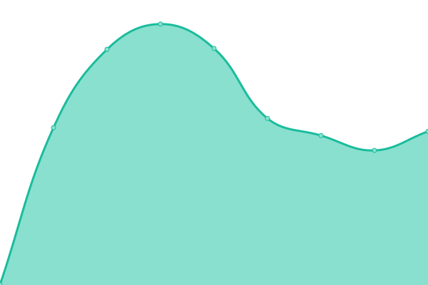

# [📈 Live Status](https://upptime.github.io/upptime): <!--live status--> **🟧 Partial outage**

This repository contains the open-source uptime monitor and status page for [Upptime](https://upptime.js.org), powered by [Upptime](https://github.com/upptime/upptime).

With [Upptime](https://upptime.js.org), you can get your own unlimited and free uptime monitor and status page, powered entirely by a GitHub repository. We use [Issues](https://github.com/upptime/upptime/issues) as incident reports, [Actions](https://github.com/asm0dey/status/actions) as uptime monitors, and [Pages](https://upptime.github.io/upptime) for the status page.

<!--start: status pages-->
<!-- This summary is generated by Upptime (https://github.com/upptime/upptime) -->
<!-- Do not edit this manually, your changes will be overwritten -->
<!-- prettier-ignore -->
| URL | Status | History | Response Time | Uptime |
| --- | ------ | ------- | ------------- | ------ |
|  [Root](https://asm0dey.ru) | 🟩 Up | [root.yml](https://github.com/asm0dey/status/commits/HEAD/history/root.yml) | 

 935ms
     
 | 

<a href="https://asm0dey.github.io/status/history/root">100.00%</a>
    

|  [Blog](https://blog.asm0dey.ru) | 🟩 Up | [blog.yml](https://github.com/asm0dey/status/commits/HEAD/history/blog.yml) | 

 1079ms
     
 | 

<a href="https://asm0dey.github.io/status/history/blog">100.00%</a>
    

|  [it](https://it.asm0dey.ru) | 🟩 Up | [it.yml](https://github.com/asm0dey/status/commits/HEAD/history/it.yml) | 

 1548ms
     
 | 

<a href="https://asm0dey.github.io/status/history/it">100.00%</a>
    

|  [newpodcast](https://newpodcast2.live) | 🟩 Up | [newpodcast.yml](https://github.com/asm0dey/status/commits/HEAD/history/newpodcast.yml) | 

 947ms
     
 | 

<a href="https://asm0dey.github.io/status/history/newpodcast">100.00%</a>
    

|  [ort-club](https://ort-club.ru) | 🟩 Up | [ort-club.yml](https://github.com/asm0dey/status/commits/HEAD/history/ort-club.yml) | 

 1779ms
     
 | 

<a href="https://asm0dey.github.io/status/history/ort-club">99.45%</a>
    

|  [shortener](https://s.asm0dey.ru/rest/v2/health) | 🟩 Up | [shortener.yml](https://github.com/asm0dey/status/commits/HEAD/history/shortener.yml) | 

 625ms
     
 | 

<a href="https://asm0dey.github.io/status/history/shortener">100.00%</a>
    

|  [Nextcloud](https://nextcloud.asm0dey.ru) | 🟩 Up | [nextcloud.yml](https://github.com/asm0dey/status/commits/HEAD/history/nextcloud.yml) | 

 1652ms
     
 | 

<a href="https://asm0dey.github.io/status/history/nextcloud">100.00%</a>
    

|  [Bot](https://bot.asm0dey.ru) | 🟥 Down | [bot.yml](https://github.com/asm0dey/status/commits/HEAD/history/bot.yml) | 

 557ms
     
 | 

<a href="https://asm0dey.github.io/status/history/bot">0.00%</a>
    

<!--end: status pages-->

[**Visit our status website →**](https://asm0dey.github.io/status)

## 📄 License

- Powered by: [Upptime](https://github.com/upptime/upptime)
- Code: [MIT](./LICENSE) © [Upptime](https://upptime.js.org)
- Data in the `./history` directory: [Open Database License](https://opendatacommons.org/licenses/odbl/1-0/)
