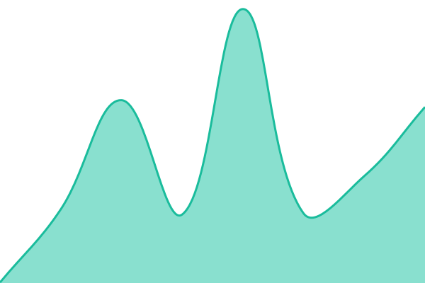
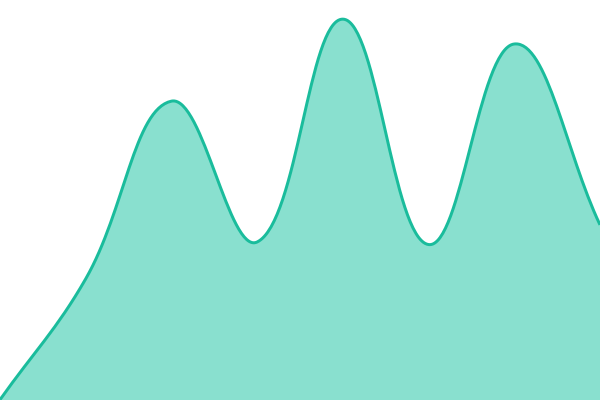

# [📈 Live Status](https://upptime.github.io/upptime): <!--live status--> **🟩 All systems operational**

This repository contains the open-source uptime monitor and status page for [Upptime](https://upptime.js.org), powered by [Upptime](https://github.com/upptime/upptime).

With [Upptime](https://upptime.js.org), you can get your own unlimited and free uptime monitor and status page, powered entirely by a GitHub repository. We use [Issues](https://github.com/upptime/upptime/issues) as incident reports, [Actions](https://github.com/asm0dey/status/actions) as uptime monitors, and [Pages](https://upptime.github.io/upptime) for the status page.

<!--start: status pages-->
<!-- This summary is generated by Upptime (https://github.com/upptime/upptime) -->
<!-- Do not edit this manually, your changes will be overwritten -->
<!-- prettier-ignore -->
| URL | Status | History | Response Time | Uptime |
| --- | ------ | ------- | ------------- | ------ |
|  [Root](https://asm0dey.site) | 🟩 Up | [root.yml](https://github.com/asm0dey/status/commits/HEAD/history/root.yml) | 

 133ms
     
 | 

<a href="https://asm0dey.github.io/status/history/root">100.00%</a>
    

|  [Blog](https://blog.asm0dey.ru) | 🟩 Up | [blog.yml](https://github.com/asm0dey/status/commits/HEAD/history/blog.yml) | 

 1755ms
     
 | 

<a href="https://asm0dey.github.io/status/history/blog">100.00%</a>
    

|  [it](https://it.asm0dey.ru) | 🟩 Up | [it.yml](https://github.com/asm0dey/status/commits/HEAD/history/it.yml) | 

 1252ms
     
 | 

<a href="https://asm0dey.github.io/status/history/it">100.00%</a>
    

|  [newpodcast](https://newpodcast2.live) | 🟩 Up | [newpodcast.yml](https://github.com/asm0dey/status/commits/HEAD/history/newpodcast.yml) | 

 1289ms
     
 | 

<a href="https://asm0dey.github.io/status/history/newpodcast">100.00%</a>
    

|  [ort-club](https://ort-club.ru) | 🟩 Up | [ort-club.yml](https://github.com/asm0dey/status/commits/HEAD/history/ort-club.yml) | 

 1796ms
     
 | 

<a href="https://asm0dey.github.io/status/history/ort-club">100.00%</a>
    

|  [school-crm](https://school-crm.asm0dey.ru) | 🟩 Up | [school-crm.yml](https://github.com/asm0dey/status/commits/HEAD/history/school-crm.yml) | 

 235ms
     
 | 

<a href="https://asm0dey.github.io/status/history/school-crm">100.00%</a>
    

|  [fb2cng](https://fb2cng.asm0dey.site) | 🟩 Up | [fb2cng.yml](https://github.com/asm0dey/status/commits/HEAD/history/fb2cng.yml) | 

 1659ms
     
 | 

<a href="https://asm0dey.github.io/status/history/fb2cng">100.00%</a>
    

|  [Authelia](https://auth.asm0dey.site) | 🟩 Up | [authelia.yml](https://github.com/asm0dey/status/commits/HEAD/history/authelia.yml) | 

 402ms
     
 | 

<a href="https://asm0dey.github.io/status/history/authelia">100.00%</a>
    

|  [Grafana](https://grafana.asm0dey.site) | 🟩 Up | [grafana.yml](https://github.com/asm0dey/status/commits/HEAD/history/grafana.yml) | 

 1373ms
     
 | 

<a href="https://asm0dey.github.io/status/history/grafana">100.00%</a>
    

|  [Ward](https://ward.asm0dey.site) | 🟩 Up | [ward.yml](https://github.com/asm0dey/status/commits/HEAD/history/ward.yml) | 

 528ms
     
 | 

<a href="https://asm0dey.github.io/status/history/ward">100.00%</a>
    

|  [Umami](https://shynet.asm0dey.ru) | 🟩 Up | [umami.yml](https://github.com/asm0dey/status/commits/HEAD/history/umami.yml) | 

 496ms
     
 | 

<a href="https://asm0dey.github.io/status/history/umami">100.00%</a>
    

|  [Gotify](https://gotify.asm0dey.ru) | 🟩 Up | [gotify.yml](https://github.com/asm0dey/status/commits/HEAD/history/gotify.yml) | 

 476ms
     
 | 

<a href="https://asm0dey.github.io/status/history/gotify">100.00%</a>
    

|  [OpenCloud](https://opencloud.asm0dey.site) | 🟩 Up | [open-cloud.yml](https://github.com/asm0dey/status/commits/HEAD/history/open-cloud.yml) | 

 1269ms
     
 | 

<a href="https://asm0dey.github.io/status/history/open-cloud">100.00%</a>
    

|  [Immich](https://photo.asm0dey.ru) | 🟩 Up | [immich.yml](https://github.com/asm0dey/status/commits/HEAD/history/immich.yml) | 

 617ms
     
 | 

<a href="https://asm0dey.github.io/status/history/immich">100.00%</a>
    

|  [Karakeep](https://keep.asm0dey.site) | 🟩 Up | [karakeep.yml](https://github.com/asm0dey/status/commits/HEAD/history/karakeep.yml) | 

 1156ms
     
 | 

<a href="https://asm0dey.github.io/status/history/karakeep">100.00%</a>
    

|  [PdfDing](https://pdf.asm0dey.site) | 🟩 Up | [pdf-ding.yml](https://github.com/asm0dey/status/commits/HEAD/history/pdf-ding.yml) | 

 826ms
     
 | 

<a href="https://asm0dey.github.io/status/history/pdf-ding">100.00%</a>
    

|  [Tandoor](https://tandoor.asm0dey.site) | 🟩 Up | [tandoor.yml](https://github.com/asm0dey/status/commits/HEAD/history/tandoor.yml) | 

 835ms
     
 | 

<a href="https://asm0dey.github.io/status/history/tandoor">100.00%</a>
    

|  [Miniflux](https://miniflux.news.asm0dey.site) | 🟩 Up | [miniflux.yml](https://github.com/asm0dey/status/commits/HEAD/history/miniflux.yml) | 

 479ms
     
 | 

<a href="https://asm0dey.github.io/status/history/miniflux">100.00%</a>
    

|  [Nextflux](https://news.asm0dey.site) | 🟩 Up | [nextflux.yml](https://github.com/asm0dey/status/commits/HEAD/history/nextflux.yml) | 

 451ms
     
 | 

<a href="https://asm0dey.github.io/status/history/nextflux">100.00%</a>
    

|  [calit](https://cal.asm0dey.site) | 🟩 Up | [calit.yml](https://github.com/asm0dey/status/commits/HEAD/history/calit.yml) | 

 533ms
     
 | 

<a href="https://asm0dey.github.io/status/history/calit">100.00%</a>
    

|  [Grimmory](https://grimmory.asm0dey.site) | 🟩 Up | [grimmory.yml](https://github.com/asm0dey/status/commits/HEAD/history/grimmory.yml) | 

 765ms
     
 | 

<a href="https://asm0dey.github.io/status/history/grimmory">100.00%</a>
    

|  [Home Assistant](https://homeassistant.asm0dey.site) | 🟩 Up | [home-assistant.yml](https://github.com/asm0dey/status/commits/HEAD/history/home-assistant.yml) | 

 503ms
     
 | 

<a href="https://asm0dey.github.io/status/history/home-assistant">100.00%</a>
    

|  [Hubitat](https://hubitat.asm0dey.site) | 🟩 Up | [hubitat.yml](https://github.com/asm0dey/status/commits/HEAD/history/hubitat.yml) | 

 645ms
     
 | 

<a href="https://asm0dey.github.io/status/history/hubitat">100.00%</a>
    

|  [Radarr](https://radarr.asm0dey.site) | 🟩 Up | [radarr.yml](https://github.com/asm0dey/status/commits/HEAD/history/radarr.yml) | 

 2741ms
     
 | 

<a href="https://asm0dey.github.io/status/history/radarr">100.00%</a>
    

|  [Sonarr](https://sonarr.asm0dey.site) | 🟩 Up | [sonarr.yml](https://github.com/asm0dey/status/commits/HEAD/history/sonarr.yml) | 

 2455ms
     
 | 

<a href="https://asm0dey.github.io/status/history/sonarr">100.00%</a>
    

|  [Prowlarr](https://prowlarr.asm0dey.site) | 🟩 Up | [prowlarr.yml](https://github.com/asm0dey/status/commits/HEAD/history/prowlarr.yml) | 

 2313ms
     
 | 

<a href="https://asm0dey.github.io/status/history/prowlarr">100.00%</a>
    

|  [Autobrr](https://autobrr.asm0dey.site) | 🟩 Up | [autobrr.yml](https://github.com/asm0dey/status/commits/HEAD/history/autobrr.yml) | 

 642ms
     
 | 

<a href="https://asm0dey.github.io/status/history/autobrr">100.00%</a>
    

|  [Profilarr](https://profilarr.asm0dey.site) | 🟩 Up | [profilarr.yml](https://github.com/asm0dey/status/commits/HEAD/history/profilarr.yml) | 

 1229ms
     
 | 

<a href="https://asm0dey.github.io/status/history/profilarr">100.00%</a>
    

|  [Shelfarr](https://shelfarr.asm0dey.site) | 🟩 Up | [shelfarr.yml](https://github.com/asm0dey/status/commits/HEAD/history/shelfarr.yml) | 

 684ms
     
 | 

<a href="https://asm0dey.github.io/status/history/shelfarr">100.00%</a>
    

<!--end: status pages-->

[**Visit our status website →**](https://asm0dey.github.io/status)

## 📄 License

- Powered by: [Upptime](https://github.com/upptime/upptime)
- Code: [MIT](./LICENSE) © [Upptime](https://upptime.js.org)
- Data in the `./history` directory: [Open Database License](https://opendatacommons.org/licenses/odbl/1-0/)
